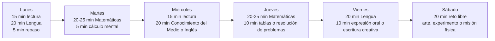

[No verificado] No he podido verificar en esta sesión el texto íntegro del decreto autonómico de currículo de la Comunidad de Madrid en una fuente oficial accesible; por ello, este informe prioriza las enseñanzas mínimas oficiales vigentes del BOE, que Madrid debe incorporar a su currículo, y deja como **sin especificar** cualquier concreción estrictamente autonómica o cualquier reparto por curso que no figure expresamente en la norma consultada. citeturn19view1turn20view1turn43view2

# Currículo oficial y aprendizajes esperados en 2.º y 3.º de Primaria en la Comunidad de Madrid

## Resumen ejecutivo

La Educación Primaria se organiza legalmente en **tres ciclos de dos cursos** y el currículo oficial vigente se formula **por ciclos**, no por cursos aislados. Eso afecta directamente a 2.º y 3.º: **2.º cierra el primer ciclo** y **3.º abre el segundo ciclo**. En ambos cursos las áreas comunes son Conocimiento del Medio Natural, Social y Cultural, Educación Artística, Educación Física, Lengua Castellana y Literatura, Lengua Extranjera y Matemáticas; además, la enseñanza de Religión debe ofrecerse y, si no se cursa, el centro ha de organizar Atención educativa. La Educación en Valores Cívicos y Éticos solo se incorpora en algún curso del **tercer ciclo**, por lo que no corresponde ni a 2.º ni a 3.º. citeturn19view1turn19view2turn38view1

Desde el punto de vista pedagógico, el salto entre 2.º y 3.º es nítido. En 2.º predominan la **consolidación de la lectura y la escritura iniciales**, la **numeración y operaciones básicas**, la observación del entorno próximo, los hábitos saludables y la participación guiada. En 3.º aparece una exigencia mayor de **autonomía**, comprensión inferencial, resolución más estructurada de problemas, inicio claro del **pensamiento multiplicativo**, producción escrita algo más cohesionada, búsqueda y comunicación de información, y una indagación más sistemática en ciencias y en historia. citeturn31view0turn32view0turn36view0turn36view1turn24view0

La evaluación oficial en Primaria es **global, continua y formativa**, centrada en el grado de desarrollo de las competencias y en el progreso del alumnado; además, la norma pide instrumentos variados, accesibles y adaptados, y prevé medidas de refuerzo en cuanto aparezcan dificultades. Para una app educativa esto tiene una consecuencia importante: no conviene diseñar solo “preguntas correctas/incorrectas”, sino circuitos de progreso con práctica guiada, repetición espaciada, retos por niveles, seguimiento del error y evidencias variadas de aprendizaje. citeturn43view0turn43view1turn43view2

El cuadernillo de tablas de multiplicar que has aportado encaja especialmente bien con el paso de 2.º a 3.º, porque el currículo del segundo ciclo ya contempla la **construcción de las tablas de multiplicar** a partir de suma repetida, número de veces y disposiciones en cuadrícula. citeturn37view0 El cuadernillo subido aporta un punto de partida práctico para esa línea de trabajo. fileciteturn0file0

## Marco normativo y criterio de lectura curricular

El marco básico aplicable es el **Real Decreto 157/2022**, que define objetivos de etapa, competencias clave, competencias específicas, criterios de evaluación y saberes básicos; además, precisa que los **criterios y saberes se establecen para cada ciclo**, no para cada curso. También fija que, en comunidades sin lengua cooficial como Madrid, las enseñanzas mínimas estatales ocupan el **60 %** del horario escolar y que el resto lo concretan la comunidad autónoma y los centros. citeturn6view0turn19view1turn43view2

Las **competencias clave** del currículo son ocho: comunicación lingüística, plurilingüe, matemática y en ciencia/tecnología/ingeniería, digital, personal-social-aprender a aprender, ciudadana, emprendedora y en conciencia y expresión culturales. En la práctica, ninguna materia trabaja una sola competencia; todas contribuyen de forma transversal al Perfil de salida del alumnado. citeturn20view2

Conviene leer el currículo actual con una idea importante: la LOMLOE ya no toma como referencia principal los antiguos **“estándares de aprendizaje evaluables”**. La norma vigente trabaja con **competencias específicas, criterios de evaluación y saberes básicos**; los estándares del currículo anterior quedaron con un carácter meramente orientativo en la transición de 2022-2023. Para un pedagogo o desarrollador esto significa que la app no debería organizarse como una colección rígida de microítems aislados, sino como una combinación de destrezas, contextos y evidencias. citeturn6view0turn20view1

También son muy relevantes dos principios pedagógicos oficiales: todos los centros deben dedicar **un tiempo diario a la lectura**, y el horario debe reservar tiempo para **proyectos significativos** y **resolución colaborativa de problemas**. Para diseño de producto, esto favorece una arquitectura con sesiones breves, rutinas diarias, tareas interdisciplinares y retos cooperativos o familiares, no solo prácticas individuales. citeturn20view1

## Materias oficiales y síntesis analítica por materia

La tabla siguiente resume las áreas oficiales presentes en 2.º y 3.º y el tiempo mínimo estatal de referencia por ciclo. He convertido las horas anuales mínimas en un promedio semanal sobre 35 semanas lectivas, tomando como referencia el mínimo legal de **175 días**. La concreción exacta de la Comunidad de Madrid por curso y centro queda **sin especificar** aquí cuando no aparece de forma expresa en la fuente consultada. citeturn39view1turn38view1

| Área | 2.º Primaria | 3.º Primaria | Horas mínimas anuales del ciclo | Promedio semanal aprox. |
|---|---|---:|---:|---:|
| Conocimiento del Medio Natural, Social y Cultural | Sí | Sí | 160 | 4 h 35 min |
| Educación Artística | Sí | Sí | 120 | 3 h 25 min |
| Educación Física | Sí | Sí | 100 | 2 h 50 min |
| Lengua Castellana y Literatura | Sí | Sí | 280 | 8 h |
| Lengua Extranjera | Sí | Sí | 120 | 3 h 25 min |
| Matemáticas | Sí | Sí | 180 en 1.º ciclo / 185 en 2.º ciclo | 5 h 10 min en 2.º / 5 h 17 min en 3.º |
| Religión / Atención educativa | Oferta obligatoria / alternativa organizada por el centro | Oferta obligatoria / alternativa organizada por el centro | 70 | 2 h |
| Educación en Valores Cívicos y Éticos | No | No | Solo 3.º ciclo | — |

**Conocimiento del Medio Natural, Social y Cultural.**  
En el primer ciclo, el área persigue que el alumnado observe su entorno cercano, formule preguntas, realice predicciones sencillas, clasifique seres vivos y materiales, desarrolle hábitos saludables, ordene hechos próximos en el tiempo, valore manifestaciones culturales cercanas y participe en acuerdos básicos de convivencia y movilidad segura. En el segundo ciclo, el currículo exige una indagación más sistemática, con búsqueda y selección de información, experimentos guiados, identificación de relaciones entre elementos del medio, primeros planteamientos sobre problemas ecosociales y una historia ya más estructurada, que en los criterios de evaluación se sitúa **desde la Prehistoria hasta la Edad Antigua**. citeturn23view0turn23view1turn24view0turn30view2

[Inferencia] Reordenando los saberes oficiales en formato de diseño didáctico, en 2.º predominan como **conceptos** los seres vivos, la luz y el sonido, el tiempo cotidiano, el entorno, la familia y los servicios próximos; como **procedimientos**, observar, clasificar, medir, registrar, secuenciar y dialogar reglas; y como **actitudes**, curiosidad, cuidado del entorno, respeto y corresponsabilidad. En 3.º aumentan el peso de la **indagación**, la argumentación sencilla y la relación entre acción humana y medio, así como la primera comprensión histórica más sistemática. citeturn23view1turn24view0turn30view2

[Inferencia] Al final de 2.º cabría esperar que el alumno reconozca y describa fenómenos cercanos, ordene hechos familiares o escolares, adopte rutinas saludables y explique normas básicas de convivencia y seguridad. Al final de 3.º cabría esperar que plantee una pregunta de investigación sencilla, registre observaciones, relacione hechos históricos básicos de Prehistoria y Antigüedad y proponga medidas elementales de cuidado ambiental. Estas formulaciones son expectativas razonables derivadas del cierre del primer ciclo y del arranque del segundo, porque la norma no explicita resultados separados por curso. citeturn19view1turn43view2turn24view0turn30view2

| Curso | Actividades y ejercicios propuestos | Adaptación lúdica tipo peonzas |
|---|---|---|
| 2.º | Diario del tiempo y del cielo; clasificación de hojas, animales o materiales del patio; línea del tiempo de “un día / una semana / mi familia”. | “Exploradores de arena”: cada misión superada desbloquea piezas de una peonza exploradora. |
| 3.º | Mini-laboratorio de mezclas y observaciones; misión “eco-alerta” sobre agua o residuos; juego cronológico de Prehistoria y Egipto/Roma. | “Liga de civilizaciones”: cada reto histórico o científico gana energía, defensa o velocidad para la peonza. |

**Educación Artística.**  
La norma organiza el área en cuatro bloques: recepción y análisis, creación e interpretación, artes plásticas/visuales/audiovisuales, y música y artes escénicas/performativas. En 2.º se insiste en la recepción activa, el vocabulario básico, la exploración de color, línea, textura, sonido, voz, instrumentos y expresión corporal, así como en producciones elementales guiadas. En 3.º aparece un paso adelante: análisis básico con perspectiva de género, planificación más consciente del proceso creativo, lectura e interpretación de imágenes, narración audiovisual sencilla, edición básica y una práctica musical y corporal más rica, con improvisación y pequeñas coreografías o dramatizaciones. citeturn25view0turn26view0turn26view1turn26view2

[Inferencia] En 2.º los **conceptos** clave son los elementos básicos del lenguaje visual y sonoro; los **procedimientos**, observar, describir, manipular materiales, componer sencillamente y representar; y las **actitudes**, curiosidad, respeto, escucha y confianza creativa. En 3.º se amplían esos mismos ejes con un componente mayor de selección, revisión y comunicación del propio proceso artístico. citeturn26view1turn26view2

[Inferencia] Al final de 2.º es razonable esperar producción artística guiada, identificación básica de elementos sonoros y visuales y participación respetuosa en experiencias compartidas. Al final de 3.º se espera además una mayor intención expresiva, comprensión de recursos audiovisuales simples y participación cooperativa más consciente en proyectos creativos. citeturn26view1turn26view2

| Curso | Actividades y ejercicios propuestos | Adaptación lúdica tipo peonzas |
|---|---|---|
| 2.º | Collage de texturas y colores; construcción de cotidiáfonos; dramatización breve de una escena cotidiana. | “Taller de personalización”: colores, pegatinas y sonidos de la peonza se desbloquean creando obras. |
| 3.º | Storyboard de una microhistoria; grabación y edición básica de audio; coreografía corta con pulsos y compases. | “Modo taller”: cada creación mejora la “aura artística” de la peonza y abre escenarios nuevos. |

**Educación Física.**  
La Educación Física en Primaria se vincula oficialmente con estilo de vida activo, conocimiento corporal, toma de decisiones en situaciones motrices, regulación emocional, cultura motriz y relación sostenible con el entorno. En 2.º se priorizan desplazamientos activos, higiene, postura, juegos de activación y vuelta a la calma, primeras decisiones motrices, identificación de emociones durante el juego, respeto a reglas y práctica de juegos y danzas del entorno. En 3.º se espera ya aplicar rutinas de preparación de la práctica, cuidar material, prevenir lesiones, participar en proyectos motores, ajustar decisiones a lógicas de cooperación y oposición, y desarrollar habilidades sociales e inclusión con mayor deliberación. citeturn27view0turn27view1turn28view0

[Inferencia] En 2.º los **conceptos** giran en torno a salud física básica, reglas, cooperación y expresividad corporal; los **procedimientos** incluyen correr, lanzar, coordinarse, calentar, relajarse y seguir consignas; y las **actitudes** son cuidado del cuerpo, deportividad y respeto. En 3.º se amplían la estrategia motriz, la prevención, la autoimagen saludable y el cuidado del entorno, incluyendo movilidad segura y uso responsable de espacios. citeturn27view1turn28view0

[Inferencia] Al final de 2.º cabría esperar participación activa, cumplimiento básico de reglas y reconocimiento de emociones en juego. Al final de 3.º ya debería observarse más control corporal, cooperación eficaz, prevención elemental de riesgos y rechazo explícito de conductas discriminatorias en el juego. citeturn27view1turn28view0

| Curso | Actividades y ejercicios propuestos | Adaptación lúdica tipo peonzas |
|---|---|---|
| 2.º | Circuito motor con estaciones; juego de relevos con normas cooperativas; secuencia de calentamiento ilustrada. | “Modo arena física”: cada reto corporal suma impulso para lanzar la peonza. |
| 3.º | Mini-retos cooperativos con roles; coreografía motriz en grupo; gymkana de movilidad y seguridad vial. | “Combate por equipos”: la peonza mejora cuando el grupo cumple misión compartida, no solo individual. |

**Lengua Castellana y Literatura.**  
El currículo de Lengua se articula en torno a hablar, escuchar, leer y escribir, y añade búsqueda de información, educación literaria, reflexión sobre la lengua y uso ético del lenguaje. En 2.º, el foco sigue puesto en el afianzamiento del código escrito, la comprensión global de textos cercanos, la producción oral y escrita sencilla modelada, la narración, descripción y diálogo, la ortografía natural y las primeras conversaciones literarias. En 3.º, el segundo ciclo introduce un nivel mayor de inferencia, incorpora la **exposición** a las tipologías trabajadas, refuerza la ortografía reglada básica, la cohesión entre oraciones y párrafos, la evaluación inicial de la fiabilidad de textos, la valoración argumentada de lecturas y la producción escrita algo más autónoma. citeturn29view0turn31view0turn31view1turn32view0

La norma también exige un **tiempo diario de lectura** y recomienda comunidades lectoras y proyectos significativos. Para una app, eso sugiere sesiones cortas diarias, biblioteca interna o itinerarios lectores, lectura en voz alta con apoyo visual, y escritura de textos breves pero frecuentes. citeturn20view1turn29view1

[Inferencia] En 2.º los **conceptos** más visibles son texto narrativo, descriptivo y dialogado, idea principal, vocabulario próximo y concordancia básica; los **procedimientos**, lectura compartida, copia funcional, planificación muy guiada, revisión simple y conversación literaria; y las **actitudes**, gusto lector, escucha, respeto lingüístico y lenguaje no discriminatorio. En 3.º se añade una mayor conciencia de propósito comunicativo, inferencias, exposición y revisión metalingüística algo más rica. citeturn31view0turn32view0

[Inferencia] Al final de 2.º conviene esperar lectura comprensiva básica, producción de frases y pequeños textos coherentes, y participación ordenada en intercambio oral. Al final de 3.º ya debería verse comprensión inferencial sencilla, escritura breve con algo más de cohesión y ortografía reglada básica, y una conversación sobre lecturas con razones elementales. citeturn31view0turn32view0

| Curso | Actividades y ejercicios propuestos | Adaptación lúdica tipo peonzas |
|---|---|---|
| 2.º | Lectura acompañada con preguntas literales; ordenar viñetas y escribir el diálogo; dictados breves con autocorrección guiada. | “Modo historia”: cada texto leído desbloquea personajes, pistas o giros de la trama. |
| 3.º | Escribir una mini exposición sobre un animal o invento; detectar idea principal e inferencias simples; recrear un poema o cuento cambiando final. | “Batalla narrativa”: el jugador gana piezas especiales si interpreta, reescribe y explica su lectura. |

**Lengua Extranjera.**  
La finalidad oficial del área es la adquisición de una **competencia comunicativa básica** y el crecimiento de la conciencia intercultural. En 2.º el currículo se centra en reconocer palabras y expresiones frecuentes, producir frases cortas con modelos, escribir palabras y expresiones conocidas, participar en interacciones muy guiadas y comenzar a comparar lenguas. En 3.º el segundo ciclo pide captar el sentido global de textos orales, escritos y multimodales breves, redactar textos muy cortos ajustados a una situación, mantener interacciones breves con cortesía lingüística y etiqueta digital, e iniciarse en la autoevaluación y coevaluación del propio aprendizaje. citeturn33view0turn34view0turn33view2turn33view3

[Inferencia] En 2.º los **conceptos** se apoyan en léxico elemental de relaciones personales, lugares y rutinas, junto con saludos, preguntas básicas y patrones sonoros elementales; los **procedimientos** son escuchar, repetir, señalar, relacionar imagen-palabra, completar modelos y formular respuestas mínimas; y las **actitudes** son autoconfianza comunicativa, empatía y curiosidad cultural. En 3.º crece la mediación sencilla, el uso de apoyos digitales y la conciencia de etiqueta comunicativa. citeturn34view0turn33view2turn33view3

[Inferencia] Al final de 2.º es razonable esperar comprensión de instrucciones y expresiones muy frecuentes y producción de respuestas muy cortas. Al final de 3.º cabe esperar comprensión global de mensajes breves, escritura muy simple ajustada al contexto y participación en intercambios pequeños con cortesía y apoyo. citeturn34view0turn33view2

| Curso | Actividades y ejercicios propuestos | Adaptación lúdica tipo peonzas |
|---|---|---|
| 2.º | Bingo de vocabulario con imagen; repetir y grabar saludos/presentaciones; completar tarjetas “This is… / I like…”. | “Lanzamiento de frases”: cada frase correcta activa un giro más estable. |
| 3.º | Mini-diálogo grabado; escribir una nota o ficha personal breve; escuchar un audio y elegir idea global e información visible. | “Duelo de señales”: para lanzar hay que escuchar, entender y responder con rapidez. |

**Matemáticas.**  
Las matemáticas se conciben oficialmente como un área instrumental y transversal, con especial peso del razonamiento, la resolución de problemas, el pensamiento computacional, el manejo de datos y la dimensión socioafectiva del aprendizaje. En 2.º, el primer ciclo trabaja números naturales hasta **999**, cálculo mental básico, suma y resta con sentido, sistema monetario europeo básico, magnitudes cercanas, figuras geométricas simples, patrones y organización sencilla de datos, además de actitudes positivas frente al error y el trabajo cooperativo. En 3.º el salto es claro: números hasta **9999**, fracciones propias en contextos cotidianos, identificación de las operaciones útiles en problemas, **construcción de las tablas de multiplicar**, multiplicación y división como reparto o partición, conversión sencilla de unidades, perímetros, interpretación de itinerarios y primeras ideas de incertidumbre y gráficos más ricos. citeturn35view0turn35view1turn36view0turn36view1turn37view0

[Inferencia] En 2.º los **conceptos** clave son cantidad, suma/resta, comparación, medida y forma; los **procedimientos**, representar con material manipulativo, contar, estimar, medir y explicar pasos; y las **actitudes**, perseverancia, curiosidad y aceptación del error. En 3.º el currículo desplaza el centro hacia el **pensamiento multiplicativo**, la modelización más clara del problema, la comunicación matemática y el uso de herramientas tecnológicas adecuadas. citeturn36view0turn36view1turn37view0

[Inferencia] Al final de 2.º debería observarse resolución de problemas aditivos sencillos con apoyo, manejo seguro de numeración hasta 999 y lectura inicial de datos y medidas. Al final de 3.º ya es razonable esperar uso operativo de tablas, inicio de multiplicación/división en problemas, comparación de fracciones simples en contexto, medida más precisa y comunicación verbal o gráfica del proceso seguido. citeturn36view0turn36view1turn37view0

| Curso | Actividades y ejercicios propuestos | Adaptación lúdica tipo peonzas |
|---|---|---|
| 2.º | Tienda con euros y cambios simples; carrera en recta numérica; resolución manipulativa de sumas y restas con bloques base diez. | “Arena de energía”: cada problema sumado correctamente carga velocidad o defensa. |
| 3.º | Construcción de tablas con cuadrículas y grupos iguales; retos de reparto y partición; itinerarios y perímetros en mapas sencillos. | “Copa de multiplicación”: combos por respuestas encadenadas, jefes por tabla y recompensas por cálculo mental. |

**Religión o Atención educativa.**  
La enseñanza de Religión debe ofrecerse en Primaria, pero su currículo no lo fija el real decreto general, sino las autoridades religiosas correspondientes. Cuando no se cursa Religión, el centro debe organizar una **Atención educativa** orientada al desarrollo de competencias clave mediante proyectos significativos y resolución colaborativa de problemas; esa atención no puede convertirse en enseñanza de contenidos confesionales ni duplicar los contenidos de otra área. Para una app educativa, este espacio encaja bien con misiones transversales de lectura, lógica, convivencia, creatividad o cultura general. citeturn38view1

## Diferencias entre 2.º y 3.º y continuidad entre cursos

El cambio de 2.º a 3.º puede resumirse como el paso de una enseñanza más centrada en **consolidar bases** a otra que pide **aplicar esas bases con mayor autonomía**. En Lengua se pasa de comprender y producir textos muy cercanos a hacer inferencias sencillas, escribir algo más cohesionadamente y empezar a valorar la fiabilidad de un texto. En Matemáticas se pasa del predominio aditivo a la entrada decidida del pensamiento multiplicativo. En Conocimiento del Medio se amplía el horizonte desde lo inmediato y cotidiano hacia la indagación más sistemática y la primera historia estructurada. En Lengua Extranjera se avanza de palabra/frase modelo a texto breve con sentido global. En Artística y Educación Física se mantiene la exploración, pero con más planificación, cooperación y conciencia del proceso. citeturn31view0turn32view0turn36view0turn36view1turn24view0turn34view0turn33view2turn26view1turn28view0

La continuidad más importante no es “cambiar de temario”, sino **profundizar el mismo eje competencial**. El currículo insiste en que las competencias específicas son comunes a la etapa y que los criterios se gradúan por ciclos; en otras palabras, 3.º no debería empezar “de cero”, sino reutilizar lo trabajado en 2.º con menos andamiaje y algo más de transferencia a situaciones nuevas. citeturn19view1turn43view2

La siguiente tabla resume, de forma operativa, el salto esperado entre ambos cursos. Se trata de una **tabla analítica** construida a partir de los criterios y saberes oficiales por ciclo ya citados, no de una tabla literal del currículo. citeturn19view1turn43view2

| Materia | Competencias clave más visibles | Foco de 2.º | Foco de 3.º | Salto principal |
|---|---|---|---|---|
| Conocimiento del Medio | STEM, CD, CPSAA, CC, CE | Entorno próximo, observación, hábitos saludables, tiempo cercano, servicios e instituciones cercanas | Indagación más sistemática, relaciones ecosociales, historia de Prehistoria y Antigüedad | Del entorno inmediato al análisis guiado de relaciones y cambio histórico |
| Educación Artística | CCEC, CP, CD, CPSAA | Exploración sensorial y producción guiada | Análisis básico, proceso creativo más consciente, audiovisualidad simple | De experimentar a empezar a interpretar y comunicar intencionalmente |
| Educación Física | CPSAA, CC, CE, CCEC | Motricidad básica, juego, reglas, higiene | Proyecto motor, estrategia, cooperación, prevención y cuidado del entorno | Del juego guiado a la toma de decisiones motriz más autónoma |
| Lengua Castellana y Literatura | CCL, CP, CD, CPSAA, CCEC, CC | Lectura inicial consolidada, ortografía natural, textos cercanos | Inferencias, exposición, ortografía reglada básica, revisión y valoración lectora | De comprender y escribir lo cercano a organizar y explicar mejor |
| Lengua Extranjera | CP, CCL, CD, CPSAA, CC | Palabras y frases frecuentes con modelos | Sentido global de textos breves, notas muy simples, etiqueta digital | De repertorio básico a miniinteracciones con intención comunicativa |
| Matemáticas | STEM, CCL, CD, CPSAA, CC | 0-999, suma/resta, medida y geometría básica | 0-9999, tablas, multiplicación/división, fracciones, perímetro y datos | Del pensamiento aditivo al multiplicativo y representacional |

## Plan semanal y adaptación lúdica para app

Como referencia escolar, el BOE fija mínimos anuales por ciclo que, llevados a una semana tipo, sitúan a Lengua Castellana y Literatura y Matemáticas como áreas con mayor peso, seguidas de Conocimiento del Medio, Lengua Extranjera, Educación Artística y Educación Física. Además, todos los centros deben reservar **lectura diaria** y tiempo para **proyectos significativos** y resolución colaborativa de problemas. Esto justifica un diseño de app con una rutina corta todos los días, en lugar de sesiones largas y esporádicas. citeturn39view1turn20view1

[Inferencia] Para estudio de verano en casa, un reparto eficaz y realista sería este: en 2.º, unos **20-25 minutos diarios** de Lengua y Matemáticas alternados, más 10-15 minutos de lectura diaria y dos microbloques semanales para Conocimiento del Medio o Inglés; en 3.º, la misma estructura pero subiendo ligeramente Matemáticas y escritura, porque ahí aparecen tablas, problemas más estructurados y textos expositivos breves. Esto es una propuesta pedagógica, no un horario oficial. citeturn39view1turn20view1

Para una app con estética de peonzas, el ajuste más sólido al currículo sería el siguiente: una **liga principal** de Lengua y Matemáticas; **misiones de exploración** para Conocimiento del Medio; **personalización estética y sonora** para Artística; **retos fuera de pantalla** con validación sencilla para Educación Física; y **duelos breves de escucha, vocabulario y frases** para Lengua Extranjera. Las mecánicas más coherentes con la evaluación competencial son barras de progreso, logros por constancia, recompensas por revisión del error, niveles por dominio y retos cooperativos familiares o entre compañeros, más que el simple acierto inmediato. citeturn43view1turn20view1

Un detalle importante para tu caso es que el material de tablas de multiplicar que ya tienes puede convertirse en una **temporada temática** dentro de la app: primero construir grupos iguales y cuadrículas, después automatizar tablas, y finalmente transferirlas a reparto, partición y problemas cotidianos. Ese recorrido es mucho más fiel al currículo que presentar las tablas como pura memorización aislada. citeturn37view0 fileciteturn0file0

## Recomendaciones pedagógicas, recursos y limitaciones

Las dificultades más frecuentes en el paso de 2.º a 3.º no suelen ser “de inteligencia”, sino de automatización insuficiente, comprensión de consignas, carga de memoria de trabajo y salto demasiado brusco hacia la autonomía. Como la evaluación oficial prevé medidas de refuerzo tan pronto como se detecten dificultades, conviene que la app incorpore diagnóstico inicial, rutas cortas de recuperación y práctica acumulativa, no castigo por fallo. citeturn43view0turn43view2

| Dificultad frecuente | Señales típicas | Refuerzo pedagógico útil | Traducción a la app |
|---|---|---|---|
| Lectura poco fluida | Lee despacio y pierde el hilo | Lectura repetida breve, ecolectura, apoyo visual | Misiones de lectura diaria con audio-modelo |
| Comprensión literal buena pero inferencial débil | Contesta lo explícito pero no deduce | Preguntas “qué / por qué / para qué”, ordenar ideas | Retos de pistas y detectives de texto |
| Escritura desorganizada | Frases sueltas, poca cohesión | Plantillas de inicio-nudo-final, conectores visibles | Constructor de textos por bloques |
| Tablas no automatizadas | Cuenta de uno en uno | Grupos iguales, cuadrículas, ritmos, repaso espaciado | Combos por tabla y jefes por misión |
| Problemas matemáticos mal interpretados | Opera sin entender la pregunta | Subrayado de datos, dibujo, esquema o barra | Pantalla “entiendo el reto” antes de resolver |
| Medida y tiempo confusos | Mezcla unidades y duraciones | Reloj manipulativo, cintas métricas, calendarios | Minijuegos de equivalencias y cronómetro |
| Baja tolerancia al error | Se frustra rápido | Éxito por intentos, feedback concreto, error útil | Sistema de vidas no punitivo y reintentos guiados |
| Oralidad limitada | Respuestas mínimas o desordenadas | Modelos breves, turnos, grabación y reescucha | Duelo de voz con repetición y mejora |

[Inferencia] Como materiales recomendados en español para complementar la app, priorizaría: biblioteca de aula o doméstica con lecturas graduadas y álbumes ilustrados; cuaderno de escritor con plantillas; bloques base diez, regletas, monedas y reloj manipulativo; geoplano y cuadrículas; mapas mudos y líneas del tiempo de cartulina; fichas de experimentación simple; instrumentos caseros de ritmo; tarjetas de movimiento y circuitos físicos. Para formato digital, lo más sensato es que la app funcione también **sin conexión**, permita **misiones imprimibles**, ofrezca **retroalimentación de audio** y tenga una vista para familia o docente donde se vea proceso, no solo puntuación. citeturn20view1turn43view1

[No verificado] Queda abierta la comprobación final del decreto autonómico específico de la Comunidad de Madrid para confirmar si incorpora matices propios de horario, secuenciación o denominaciones internas que no he podido verificar en fuente oficial accesible desde esta sesión. Por prudencia, he evitado atribuir a Madrid concreciones que no consten expresamente en las fuentes consultadas. citeturn19view1turn20view1

Las fuentes base de este informe son: el **Real Decreto 157/2022** del BOE para ordenación, áreas, competencias, evaluación, promoción, religión y horario mínimo; los **anexos** del mismo real decreto para criterios y saberes por ciclo de Conocimiento del Medio, Educación Artística, Educación Física, Lengua Castellana y Literatura, Lengua Extranjera y Matemáticas; y el **cuadernillo aportado** como referencia práctica para la línea de multiplicación pensada para la app. citeturn6view0turn19view1turn20view1turn20view2turn23view0turn23view1turn24view0turn25view0turn26view0turn26view1turn26view2turn27view0turn27view1turn28view0turn29view0turn31view0turn31view1turn32view0turn33view0turn33view2turn33view3turn34view0turn35view0turn35view1turn36view0turn36view1turn37view0turn38view1turn39view1turn43view1turn43view2 fileciteturn0file0